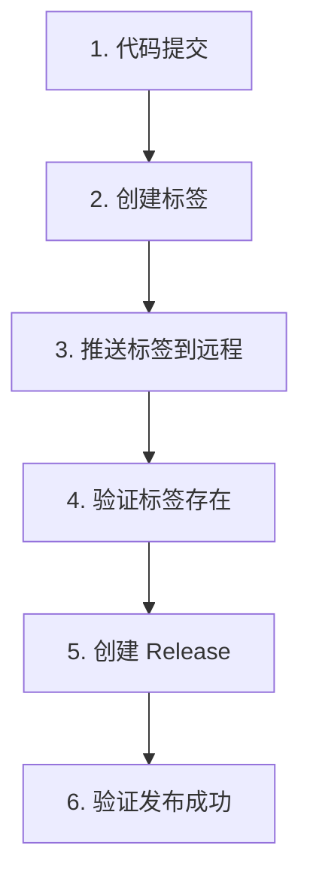

# GitHub Release 标准操作流程 (SOP)

> 本文档定义 `erp-yupoo-sync` 项目的标准化 Release 发布流程，确保每次发布稳定可靠。

---

## 核心原则

| 原则 | 说明 |
|------|------|
| **先 tag 后 release** | 标签必须先推送到远程，GitHub 才能识别版本 |
| **原子性提交** | 代码提交、标签创建、推送为独立步骤，失败可单独重试 |
| **幂等性** | 同一版本可安全重复执行，不会产生重复 Release |

---

## 标准发布流程（6 步）



### 第 1 步：代码提交

```bash
git add scripts/concurrent_batch_v2.py
git commit -m "feat(erp): industrialized sync workflow & enforce Highest Rule (v2.3.0)"
```

### 第 2 步：创建本地标签

```bash
git tag v2.3.0
```

### 第 3 步：推送标签到远程（关键！）

```bash
git push origin v2.3.0
```

> ⚠️ **这是最常被跳过的步骤，也是 `gh release create` 卡顿/失败的根因。**

### 第 4 步：验证标签已推送到远程

```bash
gh release list
# 或
git ls-remote --tags origin
```

确认标签出现在列表中后再执行下一步。

### 第 5 步：创建 GitHub Release

```bash
gh release create v2.3.0 \
  --title "v2.3.0 - Industrialized Workflow & Mandatory Audit Status" \
  --notes "### Release Notes Content"
```

### 第 6 步：验证发布成功

```bash
gh release view v2.3.0
# 或访问 https://github.com/Kevin-hr/erp-yupoo-sync/releases/tag/v2.3.0
```

---

## 错误处理

### 错误 1：`gh release create` 卡顿无响应

| 原因 | 解决 |
|------|------|
| 标签未推送到远程 | 执行 `git push origin v2.3.0` 后重试 |
| 网络握手慢 | 增加 `--skip-verification` 或等待网络恢复 |

### 错误 2：标签已存在

```bash
# 强制推送标签（仅在确定要覆盖时使用）
git push --force origin v2.3.0

# 或删除本地标签后重建
git tag -d v2.3.0
git push origin :refs/tags/v2.3.0  # 删除远程标签
git tag v2.3.0
git push origin v2.3.0
```

### 错误 3：Release 已存在

```bash
# 编辑现有 Release 的内容
gh release edit v2.3.0 --notes "更新的 Release Notes"

# 或删除后重建
gh release delete v2.3.0 --yes
gh release create v2.3.0 --title "..." --notes "..."
```

---

## 一句话清单

```
git add . ; git commit -m "msg" ; git push origin main ; git push origin v<X.Y.Z>
```

**等推送完成后，再执行：**

```
gh release create v<X.Y.Z> --title "..." --notes "..."
```

---

## 相关文件

| 文件 | 说明 |
|------|------|
| `.github/RELEASE_TEMPLATE.md` | Release Notes 模板 |
| `logs/` | 发布日志目录 |
| `CLAUDE.md` | 项目开发指南 |

---

**最后更新**：2026-04-09
