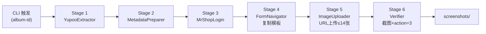
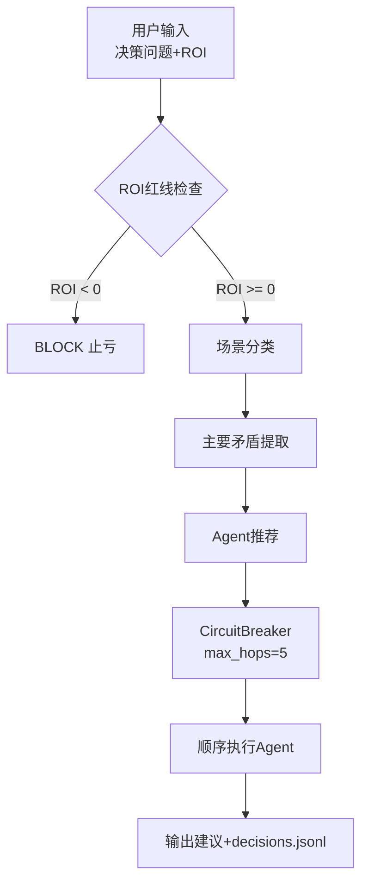

# CLAUDE.md

This file provides guidance to Claude Code (claude.ai/code) when working with code in this repository.

---

## 业务红线 (Business Critical Constraints)

> ⚠️ 以下为强制执行规则，违反将导致业务失败或账号风控

| 规则                       | 说明                            | 违规后果               |
| -------------------------- | ------------------------------- | ---------------------- |
| **禁止终端驱动浏览器** | 严禁使用终端脚本启动 Playwright 操作浏览器（指纹污染易被识别） | 触发风控拦截/验证码陷阱 |
| **登录故障检测**     | 遇到验证码、账号停用等登录阻碍即刻停止 | 触发封控/无效重试 |
| **强制下架审核** | 所有同步商品必须设为 [下架] 状态，禁止自动发布 | 违反业务合规性/误发 |
| **XHR 拦截提取** | 严禁正则拼图，必须通过拦截 `/api/albums/photos` 获取完整 Path | 404 错误/图片丢失 |
| **Fresh Navigation** | 复制完成后必须重导航至 `pkValues` URL 以激活 Vue 组件 | 页面挂载失败/无法上传 |
| **JS 注入上传** | 必须使用 JS 绕过 textarea `maxlength=153` 限制 | URL 被截断导致上传失败 |
| **审计汇报纯客观** | 所有总结输出为 `.html` 格式，包含原始数据，严禁观点 | AI 幻觉覆盖事实 |
| **Release 先推 tag** | 执行 `gh release create` 前必须先 `git push origin [tag]` | gh CLI 卡顿/超时，远程标签不存在 |
| **独立浏览器上下文** | Yupoo 和 MrShopPlus 必须各自维护独立浏览器上下文，绝不共享Cookie或浏览器状态 | SPA路由踩踏/会话混淆 |

---

## 核心原则 (Core Principles)

1. **实事求是 (Truth-Based)**: 严禁基于假设编写路径，所有路径必须经过 `ls` 或 `dir` 验证。
2. **5W1H 计划法**: 复杂任务开始前，必须明确 Who/What/When/Where/Why/How。
3. **MECE 原则**: 逻辑拆解必须做到相互独立、完全穷尽。
4. **中文注释 (Chinese Annotations)**: 所有文档、注释、CLI输出必须包含中文翻译。
5. **ASCII-Only 脚本**: 所有 PS1/BAT 脚本严禁中文字符，确保Windows环境兼容性。
6. **Trace ID 可审计**: 日志必须包含 job_id/session_id/album_id 等关联字段，支持故障追踪。

---

## 项目概述 (Project Overview)

本仓库包含**两个独立生产级子系统**：

### 1. Yupoo to MrShopPlus ERP 同步流水线
将 Yupoo 相册产品图片自动同步至 MrShopPlus ERP 完成上架。Playwright 浏览器自动化，6阶段 pipeline/orchestrator 架构。

**核心流程**：Yupoo 提取外链 → ERP 上传图片 → 自动保存验证 → 截图留证

### 2. 决策认知系统 v2.0
基于毛泽东思想四大方法论（实事求是、矛盾论、实践论、群众路线）的多智能体AI决策支持系统，服务于网红营销业务决策场景。

---

## 工作目录

**Path**: `C:\Users\Administrator\Documents\GitHub\ERP`

```bash
cd C:\Users\Administrator\Documents\GitHub\ERP
```

---

## 架构 (Architecture)

### Yupoo-to-ERP 同步流水线



### 决策认知系统 v2.0



**关键设计**: ROI检查优先于任何分析，不可被Agent推理覆盖；电路熔断防止路由循环；JSONL追加日志可审计。

---

## 项目结构 (Project Structure)

```
ERP/
├── scripts/
│   ├── sync_pipeline.py           # ✅ 主入口：Yupoo-to-ERP E2E编排器（生产可用）
│   ├── concurrent_batch_v2.py    # ⚠️ 已废弃：共享CDP架构，ERP SPA路由踩踏
│   ├── concurrent_batch_sync.py  # ⚠️ 已废弃：P0共享context Bug，违反独立浏览器红线
│   ├── erp_tab_manager.py         # ⚠️ 已废弃：Tab池假设失败（SPA无新Tab）
│   ├── batch_sync_we11done.py     # 独立脚本：we11done品牌同步
│   ├── listing_only.py            # 独立脚本：仅同步Listing不处理图片
│   ├── test_form_upload.py        # 开发调试：表单上传测试
│   └── test_local_upload.py       # 开发调试：本地上传测试
├── decision_system/               # 决策认知系统 v2.0
│   ├── __init__.py
│   ├── __main__.py                # 模块入口 (python -m decision_system)
│   ├── circuit_breaker.py          # 熔断防循环（MAX_HOPS=5）
│   ├── cli.py                     # CLI接口
│   ├── config.py                  # 配置常量（ROI阈值/新人关键词/JSONL路径）
│   ├── logging_utils.py           # JSONL日志
│   ├── router.py                  # 决策路由器
│   ├── types.py                   # Pydantic数据模型
│   ├── workflow.py                # 工作流编排（顺序dispatch，Phase 1）
│   └── tests/                     # pytest单元测试（~12个测试用例）
│       ├── conftest.py
│       ├── pytest.ini
│       ├── test_circuit_breaker.py
│       ├── test_config.py
│       ├── test_router.py
│       ├── test_types.py
│       └── test_workflow_run.py   # workflow.py run()方法测试
├── logs/
│   ├── sync_YYYYMMDD.log         # 同步流水线每日日志
│   ├── decisions.jsonl            # 决策系统日志（JSONL追加）
│   ├── cookies.json               # MrShopPlus登录Cookie
│   ├── yupoo_cookies.json         # Yupoo登录Cookie
│   └── pipeline_state.json        # 流水线断点状态（PipelineState）
├── screenshots/                   # 上架前截图留证
├── .planning/                     # 项目规划文档
│   ├── PROJECT.md / ROADMAP.md / REQUIREMENTS.md
│   ├── codebase/                  # 代码库分析（ARCHITECTURE/CONCERNS等）
│   ├── research/                  # PRD/PITFALLS/STACK等研究文档
│   └── phases/01-foundation-router/  # 决策系统Phase 1完成文档
├── .github/
│   └── RELEASE_SOP.md            # GitHub Release标准流程
├── BROWSER_SUBAGENT_SOP.md        # 浏览器操作安全协议
├── GEMINI.md                      # AI规则与决策原则
├── memory.md                      # 项目经验教训（全面复盘）
└── CLAUDE.md                      # 本文件
```

---

## 凭证管理 (Credentials)

> ⚠️ **唯一可信来源**: `.env` 文件。CLAUDE.md 中的凭证仅供参考对比。

```bash
# Yupoo
YUPOO_USERNAME=lol2024
YUPOO_PASSWORD=9longt#3
YUPOO_BASE_URL=https://lol2024.x.yupoo.com/albums

# MrShopPlus ERP
ERP_USERNAME=zhiqiang
ERP_PASSWORD=123qazwsx
ERP_BASE_URL=https://www.mrshopplus.com
```

凭证以 `os.getenv()` 方式读取，优先级：`.env` > 环境变量 > 脚本硬编码默认值。

---

## 常用命令 (Common Commands)

### 环境初始化

```bash
# 创建虚拟环境
python -m venv .venv

# Windows激活
.venv\Scripts\activate

# 安装依赖
pip install playwright pytest pydantic
playwright install chromium
```

### Yupoo-to-ERP 同步命令

```bash
# 全量同步（指定相册）
python scripts/sync_pipeline.py --album-id 231019138

# 使用CDP连接现有Chrome（需先启动Chrome）
python scripts/sync_pipeline.py --album-id 231019138 --use-cdp
```

**CDP启动Chrome（Windows）**:
```bash
"C:\Program Files\Google\Chrome\Application\chrome.exe" --remote-debugging-port=9222
```

### 决策系统命令

```bash
# CLI文本输出
python -m decision_system "要不要给这个100万粉网红送价值5000的货" --roi -500

# JSON输出
python -m decision_system "要不要免费送鞋给这个网红" --output json
```

### 测试命令（决策系统）

```bash
# 运行所有测试
pytest decision_system/tests/ -v

# 运行单个测试文件
pytest decision_system/tests/test_router.py -v

# 覆盖率报告
pytest --cov=decision_system decision_system/tests/ -v
```

### Release 命令（见 `.github/RELEASE_SOP.md`）

```bash
# 标准发布流程（必须按顺序执行）
git add . ; git commit -m "feat: ..."

# 先推代码
git push origin main

# 创建标签并推送（关键！必须在 gh release create 前执行）
git tag v<X.Y.Z>
git push origin v<X.Y.Z>

# 验证标签存在后再创建 Release
gh release list
gh release create v<X.Y.Z> --title "v<X.Y.Z>" --notes "..."
```

---

## Pipeline 6阶段详解

| Stage | 名称               | 核心动作                               | 关键约束                                    |
| ----- | ------------------ | -------------------------------------- | ------------------------------------------- |
| 1     | **EXTRACT**  | 直连 `/gallery/{id}` → CDP拦截 `/api/albums/{id}/photos` 提取完整path | 必须XHR拦截获取含hash路径，禁止正则拼图 |
| 2     | **PREPARE**  | URL换行分隔，格式化元数据，提取尺码      | 图片URL ≤14，超出截断                       |
| 3     | **LOGIN**    | MrShopPlus Cookie认证                  | 优先加载 `logs/cookies.json`；独立browser context |
| 4     | **NAVIGATE** | 访问商品列表，定位模板商品，点击"复制"  | **严禁从0创建**；复制=SPA路由跳转，非新Tab |
| 5     | **UPLOAD**   | Fresh Navigation → 替换标题/描述/图片   | TinyMCE内img标签必须清除；textarea需JS注入绕过maxlength |
| 6     | **VERIFY**   | 截图 → 保存 → 观察 URL含 `action=3`    | 必须有截图；URL变化是唯一可靠成功标志      |

---

## 数据映射 (Data Flow)

| Yupoo来源        | MrShopPlus字段 | 处理逻辑                    |
| ---------------- | -------------- | --------------------------- |
| 相册标题         | `商品名称`   | 去除内部编号（如H110）      |
| 相册描述         | `商品描述`   | 提取尺码行（M/XL/2XL），移除所有图片 |
| 图片外链（≤14） | `商品图片`   | 第15位预留给尺码表          |
| 分类             | `类别`       | 分类名映射（BAPE→T-Shirt） |

---

## 决策系统业务红线 (Decision System Business Rules)

| 规则 | 动作 |
|------|------|
| **ROI 为负** → 立即 BLOCK，建议"止亏" | 硬约束，Agent推理不能覆盖 |
| **首次网红合作** → 推荐"Model B 压测"，$10/15videos | 新人测试业务规则 |
| **流量门槛** → ≥1000播放才符合合作资格 | 质量控制 |

---

## 约束与限制 (Constraints)

| 约束 | 说明 |
|------|------|
| **单worker稳定** | `sync_pipeline.py` 单worker + CDP共享Chrome 是当前**唯一生产稳定**方案 |
| **并发踩踏** | CDP共享Chrome + 多worker → ERP SPA路由互相踩踏，**所有并发方案均已废弃** |
| **真正并发** | 每个worker需独立Chrome实例 + 不同CDP端口（9222/9223/...）+ subprocess隔离 |
| **URL上传失败** | textarea `maxlength=153` 截断URL → 必须改用本地上传（`input[type=file]`）|
| **Cookie刷新** | 会话Cookie需定期手动刷新 |
| **测试覆盖** | 决策系统有单元测试；同步流水线无自动化测试（需手动验证） |

---

## 浏览器工具链 (Browser Toolchain)

> `playwright-cli` 是终端原生浏览器自动化 CLI，无需写 Python 脚本。

### 安装

```bash
npm install -g @playwright/cli@latest
```

### 核心命令速查

| 功能 | 命令 | 适用场景 |
|------|------|----------|
| 会话状态导出/导入 | `playwright-cli state-save/load [filename]` | **导出完整 Cookie+localStorage**，绕过登录 |
| 截图 | `playwright-cli screenshot [target]` | 截图留证 |
| Tab 管理 | `playwright-cli tab-list/new/close/select` | 多 Tab 操作 |
| Cookie 管理 | `playwright-cli cookie-list/set/delete` | Session 注入/导出 |
| localStorage | `playwright-cli localstorage-set/get/clear` | Yupoo/MrShopPlus 认证持久化 |
| 网络拦截 | `playwright-cli route <pattern>` | XHR 拦截提取图片外链 |
| 网络日志 | `playwright-cli network` | 查看所有请求，调试 API |

> ⚠️ `state-save/load` 同时保存 Cookie 和 localStorage，比纯 Cookie 注入更完整，可解决 Yupoo/MrShopPlus 依赖 localStorage 的登录验证问题。

---

## ERP 已验证选择器

> 以下选择器已通过生产环境验证

| 功能 | 选择器 | 说明 |
|------|--------|------|
| 商品列表"复制"按钮 | `.operate-area .el-icon-document-copy` | Element Plus 图标按钮，非FontAwesome |
| 图片上传入口 | `.upload-container.editor-upload-btn` | 编辑区上传按钮 |
| URL上传Tab | `.el-tabs__item:has-text('URL')` | Element Plus Tab（不能用#tab-xxx ID）|
| URL输入框 | `.el-dialog .el-textarea__inner` | 弹窗内textarea（注意：有maxlength=153限制）|
| 确认上传按钮 | `.el-dialog__footer button.el-button--primary` | 弹窗底部确认 |
| TinyMCE iframe | `iframe[id^='vue-tinymce']` | Vue tinymce编辑器iframe |
| TinyMCE可编辑body | `#tinymce` | iframe内的可编辑区域 |
| 商品名称输入 | `input[placeholder='请输入商品名称']` | ERP表单标题字段 |
| 尺码输入 | `.size-chart-input input` | 尺码表输入框 |
| 保存按钮 | `button:has-text('保存')` | 商品保存（触发action=3） |

---

## 关键经验（已验证踩坑结论）

| 日期 | 问题 | 教训/解决方案 |
|------|------|--------------|
| 2026-04-08 | Yupoo 图片 404 | **XHR Interception**：拦截 `/api/albums/{id}/photos` 获取含hash完整path |
| 2026-04-08 | ERP Vue 组件未挂载 | **Fresh Navigation**：复制后强制跳转含 `pkValues` 的编辑页 |
| 2026-04-08 | textarea maxlength=153 | **JS Injection**：`evaluate` 直接控制 `ta.value` 绕过前端限制 |
| 2026-04-08 | JS/Python f-string 冲突 | **Double Curly Braces**：`f"{{ ... }}"` 转义 JS 对象字面量 |
| 2026-04-08 | gh release 卡顿 | **Remote Tag Push**：先 `git push origin [tag]` 再 `gh release create` |
| 2026-04-08 | ERP SPA "复制"是路由跳转 | 所有并发方案均失败；**唯一稳定**：单worker + CDP共享Chrome |
| 2026-04-09 | emoji导致Windows GBK日志崩溃 | 日志输出严禁emoji；使用ASCII或英文 |
| 2026-04-09 | Cookie注入 ≠ Session保持 | Yupoo/MrShopPlus 依赖 localStorage；需 `state-save/load` 完整导出 |

完整踩坑记录：`logs/CONCURRENT_DEBUG_20260408.md`

---

## 参考文档

| 文档 | 位置 | 用途 |
|------|------|------|
| **RELEASE_SOP.md** | `/.github/RELEASE_SOP.md` | GitHub Release标准流程（先tag再release） |
| **BROWSER_SUBAGENT_SOP.md** | `/BROWSER_SUBAGENT_SOP.md` | 浏览器操作安全协议 |
| **GEMINI.md** | `/GEMINI.md` | AI规则与决策原则 |
| **memory.md** | `/memory.md` | 项目历史变更与全面复盘（P0/P1/P2问题清单） |
| **CONCURRENT_DEBUG_20260408.md** | `/logs/CONCURRENT_DEBUG_20260408.md` | 并发踩坑完整记录（5类失败模式+5条核心教训） |
| **PRD_yupoo_to_erp_sync.md** | `/.planning/research/PRD_yupoo_to_erp_sync.md` | 同步流水线完整需求 |
| **PITFALLS.md** | `/.planning/research/PITFALLS.md` | 多智能体系统已知陷阱 |
| **ROADMAP.md** | `/.planning/ROADMAP.md` | 决策系统四阶段路线图 |

---

## 项目状态 (2026-04-09)

| 模块 | 状态 | 说明 |
|------|------|------|
| Yupoo-to-ERP 同步流水线 | ✅ **生产可用** | 单worker + CDP，6阶段全流程，商品已成功上架 |
| 决策认知系统 v2.0 | 🚧 **Phase 1 完成** | 路由器/熔断/日志/CLI/12个单元测试；Phase 2-4 待开发 |

---

## 已知问题清单（P0 — 必须修复）

> 来自5Agent并发审查（2026-04-08）

| # | 问题 | 位置 | 说明 |
|---|------|------|------|
| P0-1 | 凭证硬编码默认值 | `sync_pipeline.py:265` | `os.getenv("ERP_PASSWORD", "123qazwsx")` 回退值与.env不一致 |
| P0-2 | Cookie无过期检测 | `sync_pipeline.py:L366-375` | 加载cookie后不检查expiry字段 |
| P0-3 | 并发脚本共享context Bug | `scripts/concurrent_batch_sync.py:L391-398` | 违反"独立浏览器上下文"红线 |
| P0-4 | sync_pipeline.py零测试 | 全文无pytest | 需补充Stage级集成测试 |
| P0-5 | workflow.py核心编排无测试 | `workflow.py:L75-102` | run()方法ROI guard分支无覆盖 |
| P0-6 | 无requirements.txt | 项目根目录 | pip install行为不可复现 |

**完整P1/P2清单见 `memory.md`**

**This file updated: 2026-04-09**
