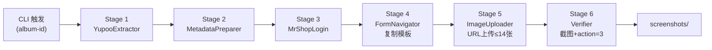
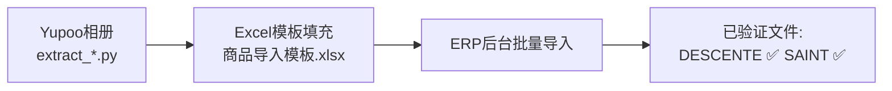

# CLAUDE.md

This file provides guidance to Claude Code (claude.ai/code) when working with code in this repository.

---

## 业务红线 (Business Critical Constraints)

> ⚠️ 以下为强制执行规则，违反将导致业务失败或账号风控

| 规则                       | 说明                                           | 违规后果                    |
| -------------------------- | ---------------------------------------------- | --------------------------- |
| **禁止终端驱动浏览器** | 严禁使用终端脚本启动 Playwright 操作浏览器（指纹污染易被识别） | 触发风控拦截/验证码陷阱 |
| **登录故障检测**     | 遇到验证码、账号停用等登录阻碍即刻停止        | 触发封控/无效重试           |
| **强制下架状态** | 所有同步商品必须设为 [N] 下架状态，禁止自动发布 | 违反业务合规性/误发        |
| **XHR 拦截提取** | 严禁正则拼图，必须通过拦截 `/api/albums/photos` 获取完整 Path | 404 错误/图片丢失 |
| **Fresh Navigation** | 复制完成后必须重导航至 `pkValues` URL 以激活 Vue 组件 | 页面挂载失败/无法上传       |
| **JS 注入上传** | 必须使用 JS 绕过 textarea `maxlength=153` 限制 | URL 被截断导致上传失败       |
| **独立浏览器上下文** | Yupoo 和 MrShopPlus 必须各自维护独立浏览器上下文，绝不共享Cookie或浏览器状态 | SPA路由踩踏/会话混淆        |
| **CDP页面清理规则** | 只能关闭自己创建的page；绝对禁止遍历 `ctx.pages` 全部关闭 | 关闭最后一个page→Chrome退出 |

---

## 核心原则 (Core Principles)

1. **实事求是 (Truth-Based)**: 严禁基于假设编写路径，所有路径必须经过 `ls` 或 `dir` 验证。
2. **5W1H 计划法**: 复杂任务开始前，必须明确 Who/What/When/Where/Why/How。
3. **MECE 原则**: 逻辑拆解必须做到相互独立、完全穷尽。
4. **中文注释 (Chinese Annotations)**: 所有文档、注释、CLI输出必须包含中文翻译。
5. **ASCII-Only 脚本**: 所有 PS1/BAT 脚本严禁中文字符，确保Windows环境兼容性。
6. **Trace ID 可审计**: 日志必须包含 job_id/session_id/album_id 等关联字段，支持故障追踪。

---

## 文件管理规则 (File Management Rules)

> ⚠️ 违反以下规则将导致仓库散落，造成版本失控

### 文件放置规范

| 目录 | 用途 | 规则 |
|------|------|------|
| `scripts/` | 生产脚本 | 统一入口，禁止散落在根目录 |
| `docs/` | 流程图/文档 | 只放 `.html`/`.md`/`.svg`，禁止放 `.py` |
| `tests/` | 测试文件 | 统一入口 |
| `logs/` | 日志输出 | 自动生成，禁止手动编辑 |
| `screenshots/` | 截图留证 | 自动生成，禁止手动编辑 |
| `.dumate/` | 临时草稿 | **禁止提交到 git**，仅本地使用 |

### 禁止行为

| 禁止项 | 原因 |
|--------|------|
| ❌ 根目录放 `.py` 脚本 | 污染仓库根目录 |
| ❌ 根目录放 Excel/CSV | 应统一到 `inputs/` 或 `templates/` |
| ❌ 根目录放 `.html` 流程图 | 应统一到 `docs/` |
| ❌ 提交临时草稿 `.dumate/` | 包含业务敏感数据 |
| ❌ 提交 `REVIEW*.md` 审查文件 | 一次性产出物 |
| ❌ 提交 `.playwright-cli/` 会话 | 浏览器状态文件 |
| ❌ 提交 `*.log` 日志文件 | 自动生成 |
| ❌ 提交 `cookies.json` | 凭证文件 |

### 每次提交前检查

```bash
# 检查是否有散落在根目录的文件
ls *.py *.xlsx *.csv *.html 2>/dev/null | grep -v README

# 检查是否有未跟踪的临时文件
git status --short | grep "^??"
```

---

## 项目概述 (Project Overview)

本仓库包含**两个独立生产级子系统**：

### 1. Yupoo to MrShopPlus ERP 同步流水线（双架构）

**架构A: Playwright 6阶段流水线** — 全自动、可截图留证，单worker约2分钟/商品
**架构B: Excel中转批量导入** — 支持批量，验证文件：`DESCENTE_232338513_商品导入模板.xlsx` ✅

---

## 工作目录

**Path**: `C:\Users\Administrator\Documents\GitHub\ERP`

---

## 架构 (Architecture)

### 双架构概览

| 架构 | 方式 | 优点 | 缺点 | 状态 |
|------|------|------|------|------|
| **A: Playwright流水线** | CDP XHR拦截 → 6阶段自动化 | 全自动、可截图留证 | 单worker | ✅ 生产可用 |
| **B: Excel中转导入** | 提取数据 → 填充模板 → ERP后台导入 | 支持批量 | 需手动触发导入 | ✅ DESCENTE验证 |

### Yupoo-to-ERP 同步流水线 (架构A)



### Excel中转架构 (架构B)



---

## 项目结构 (Project Structure)

```
ERP/
├── scripts/                          # 所有脚本入口
│   ├── sync_pipeline.py              # ✅ 架构A主入口：6阶段流水线
│   ├── extract_yupoo_info.py         # Yupoo 相册信息提取（XHR拦截）
│   ├── extract_saint_product.py      # SAINT 商品信息提取
│   ├── extract_saint_images.py       # SAINT 图片提取
│   ├── fill_excel_from_yupoo.py      # 架构B：Yupoo数据填充Excel
│   ├── yupoo_to_erp_excel.py         # 架构B：完整Excel中转流程
│   ├── generate_saint_excel.py       # 架构B：SAINT Excel生成
│   ├── generate_saint_excel_v2.py    # 架构B：SAINT Excel v2
│   └── collect_yupoo_category.py      # Yupoo分类采集
├── tests/
│   └── test_sync_pipeline.py         # ✅ sync_pipeline.py 单元测试
├── logs/                             # 凭证、日志、填充结果
│   ├── sync_YYYYMMDD.log            # 同步流水线每日日志
│   ├── cookies.json                 # MrShopPlus登录Cookie
│   ├── yupoo_cookies.json           # Yupoo登录Cookie
│   ├── pipeline_state.json          # 流水线断点状态
│   └── *.xlsx                       # Excel填充结果
├── screenshots/                      # 上架前截图留证
├── docs/                            # 流程图文档
│   ├── pipeline_flowchart.html      # ✅ 6阶段流水线流程图 v8.0
│   └── yupoo_to_erp_excel_flow.html # ✅ Excel中转流程图 v2.0
├── .planning/                        # 项目规划文档
├── .github/
│   └── RELEASE_SOP.md               # GitHub Release标准流程
├── BROWSER_SUBAGENT_SOP.md          # 浏览器操作安全协议
├── GEMINI.md                        # AI规则与决策原则
├── memory.md                         # 项目经验教训
└── CLAUDE.md                         # 本文件
```

---

## 凭证管理 (Credentials)

> ⚠️ **唯一可信来源**: `.env` 文件。CLAUDE.md 中的凭证仅供参考对比。

```bash
# Yupoo
YUPOO_USERNAME=lol2024
YUPOO_PASSWORD=9longt#3
YUPOO_BASE_URL=https://lol2024.x.yupoo.com/albums

# MrShopPlus ERP
ERP_USERNAME=zhiqiang
ERP_PASSWORD=123qazwsx
ERP_BASE_URL=https://www.mrshopplus.com
```

凭证以 `os.getenv()` 方式读取，优先级：`.env` > 环境变量 > 脚本硬编码默认值。

---

## 常用命令 (Common Commands)

### 环境初始化

```bash
# 创建虚拟环境
python -m venv .venv

# Windows激活
.venv\Scripts\activate

# 安装依赖
pip install playwright pytest pydantic openpyxl requests
playwright install chromium
```

### 架构A: Yupoo-to-ERP 同步命令

```bash
# 全量同步（指定相册）
python scripts/sync_pipeline.py --album-id 231019138

# 使用CDP连接现有Chrome（需先启动Chrome）
python scripts/sync_pipeline.py --album-id 231019138 --use-cdp
```

**CDP启动Chrome（Windows）**:
```bash
"C:\Program Files\Google\Chrome\Application\chrome.exe" --remote-debugging-port=9222
```

### 架构B: Excel填充命令

```bash
# DESCENTE Excel填充
python scripts/generate_saint_excel_v2.py --brand DESCENTE --album-id 232338513

# SAINT Excel填充
python scripts/generate_saint_excel.py --album-id 527345264973337
```

### 测试命令

```bash
# 运行流水线测试
pytest tests/test_sync_pipeline.py -v
```

---

## Pipeline 6阶段详解 (架构A)

| Stage | 名称               | 核心动作                               | 关键约束                                    |
| ----- | ------------------ | -------------------------------------- | ------------------------------------------- |
| 1     | **EXTRACT**        | 直连 `/albums/{id}` → CDP拦截 XHR 提取完整path | 必须XHR拦截；分类页选择器用 `/albums/`（非 `/gallery/`） |
| 2     | **PREPARE**        | URL换行分隔，格式化元数据，提取尺码      | 图片URL ≤14，超出截断                       |
| 3     | **LOGIN**          | MrShopPlus Cookie认证                  | 优先加载 `logs/cookies.json`；独立browser context |
| 4     | **NAVIGATE**       | 访问商品列表，定位模板商品，点击"复制"  | **严禁从0创建**；复制=SPA路由跳转，非新Tab |
| 5     | **UPLOAD**         | Fresh Navigation → 替换标题/描述/图片   | TinyMCE内img标签必须清除；textarea需JS注入绕过maxlength |
| 6     | **VERIFY**         | 截图 → 保存 → 观察 URL含 `action=3`    | 必须有截图；URL变化是唯一可靠成功标志      |

---

## Excel模板字段 (架构B: 商品导入模板.xlsx)

> **验证文件**: `DESCENTE_232338513_商品导入模板.xlsx` ✅ | `SAINT_商品导入模板_填充.xlsx` ✅

| 列 | 字段名     | 必填 | 填写规则                                          | 示例                                      |
|----|-----------|------|---------------------------------------------------|------------------------------------------|
| A  | 商品ID     | -    | 空=新增商品, 有ID=修改                            | （留空）                                 |
| B  | 商品标题*  | ✅   | 最多255字符                                       | DESCENTE ALLTERRAIN BS W ZIP JACKET      |
| C  | 副标题     | -    | 最多255字符                                       | DESCENTE 联名系列 男子防风防水夹克         |
| D  | 商品描述   | -    | HTML代码                                          | `<p><a href="...">品牌</a></p><p>描述</p>` |
| E  | 商品首图*  | ✅   | 单URL                                             | `http://pic.yupoo.com/lol2024/xxx.jpeg`  |
| F  | 商品其他图片 | -   | 多个URL用换行分隔                                 | `url1\nurl2\nurl3`                          |
| H  | 属性       | -    | `属性名|属性值` 换行分隔                           | `品牌|DESCENTE\n款号|22-0975-91` |
| I  | 商品上架*  | ✅   | **Y=上架 N=下架（强制N）**                        | N                                        |
| J  | 物流模板*  | ✅   | 系统已配置模板名                                  | 默认模板                                 |
| K  | 类别名称   | -    | 英文逗号隔开                                      | 男装,外套                                |
| L  | 标签       | -    | 英文逗号隔开                                      | DESCENTE,ALLTERRAIN,防水夹克             |
| M  | 计量单位   | -    | 按计量单位Sheet填写                               | 件                                       |
| N  | 商品备注   | -    | 最多50字                                          | `相册ID:232338513 | 款号:22-0975-91`      |
| O  | 不记库存*  | ✅   | Y=不记 N=记（跨境电商填Y）                              | Y                                        |
| P  | 商品重量*  | ✅   | kg, 3位小数                                       | 0.8                                      |
| X  | 规格1      | -    | Color+规格值                                      | `Color\nBlack`                           |
| Y  | 规格2      | -    | Size+尺码详情                                     | `Size\nM: 肩宽46cm/胸围116cm...` |
| AB | SKU值      | -    | 格式: `Color:xxx\nSize:xxx`                      | `Color:Black\nSize:M`                     |
| AC | SKU图片    | -    | 完整URL                                           | `http://pic.yupoo.com/...`               |
| AD | 售价*      | ✅   | 2位小数                                           | 88.99                                    |
| AE | 原价       | -    | 2位小数                                           | 149.99                                   |
| AF | 库存       | -    | 最多9位整数                                       | 100                                      |

**Sheet结构**: `商品信息` (主, 33列) + `计量单位` (辅助)

---

## 约束与限制 (Constraints)

| 约束 | 说明 |
|------|------|
| **单worker稳定** | `scripts/sync_pipeline.py` 单worker + CDP共享Chrome 是当前**唯一生产稳定**方案 |
| **并发踩踏** | CDP共享Chrome + 多worker → ERP SPA路由互相踩踏，**所有并发方案均已废弃** |
| **真正并发** | 每个worker需独立Chrome实例 + 不同CDP端口（9222/9223/...）+ subprocess隔离 |
| **URL上传失败** | textarea `maxlength=153` 截断URL → 必须使用JS注入绕过 |
| **Cookie刷新** | 会话Cookie需定期手动刷新 |
| **CDP页面清理** | 只能关闭自己创建的page；绝对禁止遍历 `ctx.pages` 关闭 |

---

## 浏览器工具链 (Browser Toolchain)

> `playwright-cli` 是终端原生浏览器自动化 CLI，无需写 Python 脚本。

### 安装

```bash
npm install -g @playwright/cli@latest
```

### 核心命令速查

| 功能 | 命令 | 适用场景 |
|------|------|----------|
| 会话状态导出/导入 | `playwright-cli state-save/load [filename]` | **导出完整 Cookie+localStorage**，绕过登录 |
| 截图 | `playwright-cli screenshot [target]` | 截图留证 |
| Tab 管理 | `playwright-cli tab-list/new/close/select` | 多 Tab 操作 |
| Cookie 管理 | `playwright-cli cookie-list/set/delete` | Session 注入/导出 |
| localStorage | `playwright-cli localstorage-set/get/clear` | Yupoo/MrShopPlus 认证持久化 |
| 网络拦截 | `playwright-cli route <pattern>` | XHR 拦截提取图片外链 |
| 网络日志 | `playwright-cli network` | 查看所有请求，调试 API |

> ⚠️ `state-save/load` 同时保存 Cookie 和 localStorage，比纯 Cookie 注入更完整。

---

## ERP 已验证选择器

> 以下选择器已通过生产环境验证

| 功能 | 选择器 | 说明 |
|------|--------|------|
| 商品列表"复制"按钮 | `.operate-area .el-icon-document-copy` | Element Plus 图标按钮，非FontAwesome |
| 图片上传入口 | `.upload-container.editor-upload-btn` | 编辑区上传按钮 |
| URL上传Tab | `.el-tabs__item:has-text('URL')` | Element Plus Tab（不能用#tab-xxx ID）|
| URL输入框 | `.el-dialog .el-textarea__inner` | 弹窗内textarea（注意：有maxlength=153限制）|
| 确认上传按钮 | `.el-dialog__footer button.el-button--primary` | 弹窗底部确认 |
| TinyMCE iframe | `iframe[id^='vue-tinymce']` | Vue tinymce编辑器iframe |
| TinyMCE可编辑body | `#tinymce` | iframe内的可编辑区域 |
| 商品名称输入 | `input[placeholder='请输入商品名称']` | ERP表单标题字段 |
| 尺码输入 | `.size-chart-input input` | 尺码表输入框 |
| 保存按钮 | `button:has-text('保存')` | 商品保存（触发action=3） |

---

## 关键经验（已验证踩坑结论）

| 日期 | 问题 | 教训/解决方案 |
|------|------|--------------|
| 2026-04-08 | Yupoo 图片 404 | **XHR Interception**：拦截 `/api/albums/{id}/photos` 获取含hash完整path |
| 2026-04-08 | ERP Vue 组件未挂载 | **Fresh Navigation**：复制后强制跳转含 `pkValues` 的编辑页 |
| 2026-04-08 | textarea maxlength=153 | **JS Injection**：`evaluate` 直接控制 `ta.value` 绕过前端限制 |
| 2026-04-08 | ERP SPA "复制"是路由跳转 | 所有并发方案均失败；**唯一稳定**：单worker + CDP共享Chrome |
| 2026-04-09 | Cookie注入 ≠ Session保持 | Yupoo/MrShopPlus 依赖 localStorage；需 `state-save/load` 完整导出 |
| 2026-04-14 | CDP连接Chrome遍历关闭所有page | **page_was_created flag**：只能关闭自己创建的page |
| 2026-04-15 | Excel中转架构验证通过 | DESCENTE/SAINT 填充结果已验证，33列字段完整映射 |
| 2026-04-16 | 分类页选择器返回0 | 选择器用 `/gallery/` 而非 `/albums/`；两者 URL 格式完全不同 |
| 2026-04-16 | localStorage SecurityError | 必须在 `goto('https://x.yupoo.com/')` 建立 origin 后再注入 localStorage |
| 2026-04-16 | page.evaluate() 多参数报错 | `evaluate("script", key, value)` → 改为 `"script", [key, value]` |

---

## 参考文档

| 文档 | 位置 | 用途 |
|------|------|------|
| **RELEASE_SOP.md** | `/.github/RELEASE_SOP.md` | GitHub Release标准流程 |
| **BROWSER_SUBAGENT_SOP.md** | `/BROWSER_SUBAGENT_SOP.md` | 浏览器操作安全协议 |
| **GEMINI.md** | `/GEMINI.md` | AI规则与决策原则 |
| **memory.md** | `/memory.md` | 项目历史变更与全面复盘 |
| **PRD.md** | `/.planning/PRD.md` | 需求文档 |
| **pipeline_flowchart.html** | `/docs/pipeline_flowchart.html` | ✅ 6阶段流水线流程图 |
| **yupoo_to_erp_excel_flow.html** | `/docs/yupoo_to_erp_excel_flow.html` | ✅ Excel中转流程图 |
| **SOP.md** | `/SOP.md` | 部署与运维标准流程 |

---

## 项目状态 (2026-04-16)

| 模块 | 状态 | 说明 |
|------|------|------|
| Yupoo-to-ERP 同步流水线 (架构A) | ✅ **生产可用** | 单worker + CDP，6阶段全流程，商品已成功上架 |
| Excel中转批量导入 (架构B) | ✅ **生产验证** | DESCENTE/SAINT Excel填充已验证，ERP导入成功 |
| Yupoo 分类采集 (skill) | ✅ **选择器已修复** | `/gallery/` → `/albums/`，16 cookies session 持久化 |

**This file updated: 2026-04-16**
