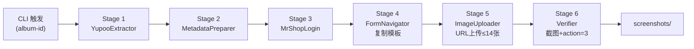

# CLAUDE.md

This file provides guidance to Claude Code (claude.ai/code) when working with code in this repository.

---

## 业务红线 (Business Critical Constraints)

> ⚠️ 以下为强制执行规则，违反将导致业务失败或账号风控

| 规则                       | 说明                                           | 违规后果                    |
| -------------------------- | ---------------------------------------------- | --------------------------- |
| **禁止终端驱动浏览器** | 严禁使用终端脚本启动 Playwright 操作浏览器（指纹污染易被识别） | 触发风控拦截/验证码陷阱 |
| **登录故障检测**     | 遇到验证码、账号停用等登录阻碍即刻停止        | 触发封控/无效重试           |
| **强制下架状态** | 所有同步商品必须设为 [N] 下架状态，禁止自动发布 | 违反业务合规性/误发        |
| **XHR 拦截提取** | 严禁正则拼图，必须通过拦截 `/api/albums/photos` 获取完整 Path | 404 错误/图片丢失 |
| **Fresh Navigation** | 复制完成后必须重导航至 `pkValues` URL 以激活 Vue 组件 | 页面挂载失败/无法上传       |
| **JS 注入上传** | 必须使用 JS 绕过 textarea `maxlength=153` 限制 | URL 被截断导致上传失败       |
| **独立浏览器上下文** | Yupoo 和 MrShopPlus 必须各自维护独立浏览器上下文，绝不共享Cookie或浏览器状态 | SPA路由踩踏/会话混淆        |
| **CDP页面清理规则** | 只能关闭自己创建的page；绝对禁止遍历 `ctx.pages` 全部关闭 | 关闭最后一个page→Chrome退出 |
| **Excel 操作强制路径** | 所有 Excel 编辑/创建/修改必须使用 `skills/minimax-xlsx` XML 流程；**禁止** openpyxl 往返编辑已有 .xlsx 文件 | 格式损坏/VBA丢失/公式破坏 |
| **BAPE Excel 填充强制** | BAPE 商品必须使用 `erp-bape-excel-filler` skill，禁止手动编辑或 openpyxl 直写 | 数据不一致/字段缺失 |
| **ERP 导入 Excel 全局标准** | 权威标准文档：`docs/ERP_EXCEL_STANDARD_BAPE0418.md` (v2.0.0 锁定) | 所有 Excel 导入操作依据 |

---

## Skills 强制使用规则

| Skill | 强制级别 | 说明 |
|-------|---------|------|
| `skills/minimax-xlsx/` | **P0 必须** | 所有 Excel 读取/创建/编辑/修复/校验必须使用 |
| `erp-bape-excel-filler` (global) | **P0 必须** | BAPE 商品填充必须使用 |
| `erp-excel-output` | P1 推荐 | ERP 商品导入模板输出时使用 |

> ⚠️ **废弃脚本**：`scripts/bape_excel_filler.py` 已删除（openpyxl 往返编辑，违反 P0 规则）

---

## 核心原则 (Core Principles)

1. **实事求是 (Truth-Based)**: 严禁基于假设编写路径，所有路径必须经过 `ls` 或 `dir` 验证。
2. **5W1H 计划法**: 复杂任务开始前，必须明确 Who/What/When/Where/Why/How。
3. **MECE 原则**: 逻辑拆解必须做到相互独立、完全穷尽。
4. **中文注释 (Chinese Annotations)**: 所有文档、注释、CLI输出必须包含中文翻译。
5. **ASCII-Only 脚本**: 所有 PS1/BAT 脚本严禁中文字符，确保Windows环境兼容性。
6. **Trace ID 可审计**: 日志必须包含 job_id/session_id/album_id 等关联字段，支持故障追踪。

---

## 文件管理规则 (File Management Rules)

> ⚠️ 违反以下规则将导致仓库散落，造成版本失控

### 文件放置规范

| 目录 | 用途 | 规则 |
|------|------|------|
| `scripts/` | 生产脚本 | 统一入口，禁止散落在根目录 |
| `docs/` | 流程图/文档 | 只放 `.html`/`.md`/`.svg`，禁止放 `.py` |
| `tests/` | 测试文件 | 统一入口 |
| `logs/` | 凭证、日志 | **仅限** `.log` / `.json`(凭证如 cookies.json)；**禁止** `.xlsx` / `.csv` / `.png` / `.html` / `.py` |
| `screenshots/` | 截图留证 | 自动生成，禁止手动编辑 |
| `inputs/` | 外部输入数据 | CSV/Excel 源文件（`bape_17款.xlsx` 等） |
| `templates/` | Excel模板 | 商品导入模板（`商品导入模板*.xlsx`） |
| `assets/` | 品牌静态资源 | Logo、水印等品牌素材 |
| `.dumate/` | 临时草稿 | **禁止提交到 git**，仅本地使用 |

### 禁止行为

| 禁止项 | 原因 |
|--------|------|
| ❌ 根目录放 `.py` 脚本 | 污染仓库根目录 |
| ❌ 根目录放 Excel/CSV | 应统一到 `inputs/` 或 `templates/` |
| ❌ 根目录放 `.html` 流程图 | 应统一到 `docs/` |
| ❌ logs/ 放 `.xlsx` / `.csv` / `.png` / `.html` / `.py` | 违反目录用途，logs/ 仅限 `.log` 和凭证 `.json` |
| ❌ 提交临时草稿 `.dumate/` | 包含业务敏感数据 |
| ❌ 提交 `REVIEW*.md` 审查文件 | 一次性产出物 |
| ❌ 提交 `.playwright-cli/` 会话 | 浏览器状态文件 |
| ❌ 提交 `*.log` 日志文件 | 自动生成 |
| ❌ 提交 `cookies.json` | 凭证文件 |

### 每次提交前检查

```bash
# 检查是否有散落在根目录的文件（除 README 外）
ls *.py *.xlsx *.csv *.html 2>/dev/null | grep -v README

# 检查 logs/ 是否混入非日志文件
ls logs/ | grep -vE "\.(log|json)$" | grep -vE "^(cookies|yupoo_cookies)\.json$"

# 检查是否有未跟踪的临时文件
git status --short | grep "^??"
```

---

## 项目概述 (Project Overview)

本仓库包含**两个独立生产级子系统**：

### 1. Yupoo to MrShopPlus ERP 同步流水线（双架构）

**架构A: Playwright 6阶段流水线** — 全自动、可截图留证，单worker约2分钟/商品
**架构B: Excel中转批量导入** — 支持批量，验证文件：`DESCENTE_232338513_ENGLISH.xlsx` ✅

---

## 工作目录

**Path**: `C:\Users\Administrator\Documents\GitHub\ERP`

---

## 架构 (Architecture)

### 双架构概览

| 架构 | 方式 | 优点 | 缺点 | 状态 |
|------|------|------|------|------|
| **A: Playwright流水线** | CDP XHR拦截 → 6阶段自动化 | 全自动、可截图留证 | 单worker | ✅ 生产可用 |
| **B: Excel中转导入** | 提取数据 → 填充模板 → ERP后台导入 | 支持批量 | 需手动触发导入 | ✅ DESCENTE验证 |

### Yupoo-to-ERP 同步流水线 (架构A)



### Excel中转架构 (架构B)

```mermaid
flowchart LR
    A["Yupoo相册<br/>extract_*.py"] --> B[Excel模板填充<br/>商品导入模板 (修改版1.0).xlsx]
    B --> C[ERP后台批量导入]
    C --> D["已验证文件:<br/>DESCENTE ✅ SAINT ✅"]
```

---

## 项目结构 (Project Structure)

```
ERP/
├── scripts/                          # 生产脚本（禁止放根目录）
├── tests/                            # 测试文件
├── logs/                             # 自动生成：凭证、日志
├── screenshots/                      # 自动生成：上架前截图留证
├── docs/                             # 流程图文档
├── inputs/                           # 外部输入数据
├── templates/                         # Excel模板
├── skills/                           # Skills 工具集
│   └── minimax-xlsx/                # ✅ Excel XML 操作（P0强制）
├── .github/
│   └── RELEASE_SOP.md               # GitHub Release标准流程
├── BAPE_0418.xlsx                   # ✅ BAPE 唯一正确模板（6行×33列）
└── CLAUDE.md                         # 本文件
```

---

## 凭证管理 (Credentials)

> ⚠️ **唯一可信来源**: `.env` 文件。CLAUDE.md 中的凭证仅供参考对比。

```bash
# Yupoo
YUPOO_USERNAME=lol2024
YUPOO_PASSWORD=9longt#3
YUPOO_BASE_URL=https://lol2024.x.yupoo.com/albums

# MrShopPlus ERP
ERP_USERNAME=zhiqiang
ERP_PASSWORD=123qazwsx
ERP_BASE_URL=https://www.mrshopplus.com
```

凭证以 `os.getenv()` 方式读取，优先级：`.env` > 环境变量 > 脚本硬编码默认值。

---

## 常用命令 (Common Commands)

### 环境初始化

```bash
# 创建虚拟环境
python -m venv .venv

# Windows激活
.venv\Scripts\activate

# 安装依赖
pip install playwright pytest pydantic openpyxl requests
playwright install chromium
```

### 架构A: Yupoo-to-ERP 同步命令

```bash
# 全量同步（指定相册）
python scripts/sync_pipeline.py --album-id 231019138

# 使用CDP连接现有Chrome（需先启动Chrome）
python scripts/sync_pipeline.py --album-id 231019138 --use-cdp
```

**CDP启动Chrome（Windows）**:
```bash
"C:\Program Files\Google\Chrome\Application\chrome.exe" --remote-debugging-port=9222
```

### 测试命令

```bash
# 运行流水线测试
pytest tests/test_sync_pipeline.py -v
```

---

## Pipeline 6阶段详解 (架构A)

| Stage | 名称               | 核心动作                               | 关键约束                                    |
| ----- | ------------------ | -------------------------------------- | ------------------------------------------- |
| 1     | **EXTRACT**        | 直连 `/albums/{id}` → CDP拦截 XHR 提取完整path | 必须XHR拦截；分类页选择器用 `/albums/`（非 `/gallery/`） |
| 2     | **PREPARE**        | URL换行分隔，格式化元数据，提取尺码      | 图片URL ≤14，超出截断                       |
| 3     | **LOGIN**          | MrShopPlus Cookie认证                  | 优先加载 `logs/cookies.json`；独立browser context |
| 4     | **NAVIGATE**       | 访问商品列表，定位模板商品，点击"复制"  | **严禁从0创建**；复制=SPA路由跳转，非新Tab |
| 5     | **UPLOAD**         | Fresh Navigation → 替换标题/描述/图片   | TinyMCE内img标签必须清除；textarea需JS注入绕过maxlength |
| 6     | **VERIFY**         | 截图 → 保存 → 观察 URL含 `action=3`    | 必须有截图；URL变化是唯一可靠成功标志      |

---

## Excel模板字段 (BAPE: BAPE_0418.xlsx)

> **标准模板**: `BAPE_0418.xlsx`（唯一正确版本，6行×33列）
> **批量输出**: `logs/bape_17款_批量_完整版.xlsx`（15个商品，64行）
> **D/B一致性**: `scripts/verify_bape_d_name_field.py` 审计通过

### BAPE字段填充标准

| 列 | 字段名 | 必填 | 填写值/来源 | 示例 |
|----|--------|------|-------------|------|
| B | 商品标题 | ✅ | `inputs/bape_17款.xlsx` A列 | `BAPE Big Ape Head Tee Black` |
| D | 商品描述HTML | ✅ | `build_desc_html()` 生成，Name:字段=strip_brand(B) | 完整HTML（含Our Core Guarantees等段落） |
| E | 商品首图 | ✅ | `bape_17款.xlsx` C列 | `http://pic.yupoo.com/...` |
| F | 商品其他图片 | - | `bape_17款.xlsx` D列（`&#10;`解码） | 多URL换行分隔 |
| H | 属性 | - | 固定值 `材质\|棉质` | BAPE_0418模板固定 |
| I | 商品上架 | ✅ | 固定值 `N`（强制下架，人工审核后才改Y） | N |
| J | 物流模板 | ✅ | 固定值 `Clothing` | BAPE_0418模板固定 |
| K | 类别名称 | - | 固定值 `BAPE` | BAPE_0418模板固定 |
| L | 标签 | - | =B列标题（脚本联动） | `BAPE Big Ape Head Tee Black` |
| M | 计量单位 | - | 固定值 `件/个` | BAPE_0418模板固定 |
| O | 不记库存 | ✅ | 固定值 `Y`（跨境电商不记库存） | Y |
| P | 商品重量 | ✅ | 固定值 `0.3` | BAPE_0418模板固定 |
| T | SEO标题 | - | `Stockx Replica Streetwear \| Top Quality 1:1 {B} - stockxshoesvip.net` | 动态生成 |
| U | SEO描述 | - | `Buy Best 1:1 Replica Clothing on Stockxshoesvip.net. Perfect {B}. 100% safe shipping...` | 动态生成 |
| V | SEO关键词 | - | =B列标题 | `BAPE Big Ape Head Tee Black` |
| Y | 规格2 | - | `Size\nS\nM\nL\nXL`（来源：`bape_17款_批量_规格2.xlsx`） | BAPE批量专用 |
| AB | SKU值(主) | - | 主行=`Size:S`；SKU子行=`Size:M/L/XL` | BAPE_0418模板固定 |
| AD | 售价 | ✅ | 固定值 `59` | BAPE_0418模板固定 |
| AE | 原价 | - | 固定值 `99` | BAPE_0418模板固定 |
| AF | 库存 | - | 固定值 `999` | BAPE_0418模板固定 |

### 禁止填写字段

| 列 | 字段名 | 原因 |
|----|--------|------|
| A | 商品ID | 空=新增商品 |
| C | 副标题 | 不需要 |
| G | 关键信息 | 不需要 |
| N | 商品备注 | 不需要 |
| Q/R/S | 包装尺寸 | 不需要 |
| W | SEO URL Handle | 自动生成 |
| X | 规格1 | 不使用颜色规格 |
| Z/AA | 规格3/4 | 不使用 |
| AC | SKU图片 | 不使用 |
| AG | SKU | 不使用 |

### D列Name:字段一致性规则

> **最高优先级**，违反即输出失败

```
B列商品标题:  BAPE LOGO RELAXED FIT TEE
                        ── strip_brand ──
D列 Name:字段:              LOGO RELAXED FIT TEE
```

`strip_brand()` 匹配：`BAPE/ xxx` 或 `BAPE xxx` 或纯 `BAPE ` 开头，贪婪去除品牌前缀。

### SKU子行结构

| 行 | AB | AD | AE | AF |
|----|----|----|----|----|
| 主Row | `Size:S` | 59 | 99 | 999 |
| Row5 | `Size:M` | 59 | 99 | 999 |
| Row6 | `Size:L` | 59 | 99 | 999 |
| Row7 | `Size:XL` | 59 | 99 | 999 |

每个商品占4行（1主行+3SKU子行），15商品共60行数据+4行表头=64行。

**Sheet结构**: `商品信息` (主, 33列) + `计量单位` (辅助)

---

## 约束与限制 (Constraints)

| 约束 | 说明 |
|------|------|
| **单worker稳定** | `scripts/sync_pipeline.py` 单worker + CDP共享Chrome 是当前**唯一生产稳定**方案 |
| **URL上传失败** | textarea `maxlength=153` 截断URL → 必须使用JS注入绕过 |
| **Cookie刷新** | 会话Cookie需定期手动刷新 |
| **CDP页面清理** | 只能关闭自己创建的page；绝对禁止遍历 `ctx.pages` 关闭 |

---

## 浏览器工具链 (Browser Toolchain)

> `playwright-cli` 是终端原生浏览器自动化 CLI，无需写 Python 脚本。

### 安装

```bash
npm install -g @playwright/cli@latest
```

### 核心命令速查

| 功能 | 命令 | 适用场景 |
|------|------|----------|
| 会话状态导出/导入 | `playwright-cli state-save/load [filename]` | **导出完整 Cookie+localStorage**，绕过登录 |
| 截图 | `playwright-cli screenshot [target]` | 截图留证 |
| Tab 管理 | `playwright-cli tab-list/new/close/select` | 多 Tab 操作 |
| Cookie 管理 | `playwright-cli cookie-list/set/delete` | Session 注入/导出 |
| localStorage | `playwright-cli localstorage-set/get/clear` | Yupoo/MrShopPlus 认证持久化 |
| 网络拦截 | `playwright-cli route <pattern>` | XHR 拦截提取图片外链 |
| 网络日志 | `playwright-cli network` | 查看所有请求，调试 API |

> ⚠️ `state-save/load` 同时保存 Cookie 和 localStorage，比纯 Cookie 注入更完整。

---

## ERP 已验证选择器

> 以下选择器已通过生产环境验证

| 功能 | 选择器 | 说明 |
|------|--------|------|
| 商品列表"复制"按钮 | `.operate-area .el-icon-document-copy` | Element Plus 图标按钮，非FontAwesome |
| 图片上传入口 | `.upload-container.editor-upload-btn` | 编辑区上传按钮 |
| URL上传Tab | `.el-tabs__item:has-text('URL')` | Element Plus Tab（不能用#tab-xxx ID）|
| URL输入框 | `.el-dialog .el-textarea__inner` | 弹窗内textarea（注意：有maxlength=153限制）|
| 确认上传按钮 | `.el-dialog__footer button.el-button--primary` | 弹窗底部确认 |
| TinyMCE iframe | `iframe[id^='vue-tinymce']` | Vue tinymce编辑器iframe |
| TinyMCE可编辑body | `#tinymce` | iframe内的可编辑区域 |
| 商品名称输入 | `input[placeholder='请输入商品名称']` | ERP表单标题字段 |
| 尺码输入 | `.size-chart-input input` | 尺码表输入框 |
| 保存按钮 | `button:has-text('保存')` | 商品保存（触发action=3） |

---

## 关键经验（已验证踩坑结论）

| 日期 | 问题 | 教训/解决方案 |
|------|------|--------------|
| 2026-04-08 | Yupoo 图片 404 | **XHR Interception**：拦截 `/api/albums/{id}/photos` 获取含hash完整path |
| 2026-04-08 | ERP Vue 组件未挂载 | **Fresh Navigation**：复制后强制跳转含 `pkValues` 的编辑页 |
| 2026-04-08 | textarea maxlength=153 | **JS Injection**：`evaluate` 直接控制 `ta.value` 绕过前端限制 |
| 2026-04-08 | ERP SPA "复制"是路由跳转 | 所有并发方案均失败；**唯一稳定**：单worker + CDP共享Chrome |
| 2026-04-09 | Cookie注入 ≠ Session保持 | Yupoo/MrShopPlus 依赖 localStorage；需 `state-save/load` 完整导出 |
| 2026-04-14 | CDP连接Chrome遍历关闭所有page | **page_was_created flag**：只能关闭自己创建的page |
| 2026-04-15 | Excel中转架构验证通过 | DESCENTE/SAINT 填充结果已验证，33列字段完整映射 |
| 2026-04-16 | 分类页选择器返回0 | 选择器用 `/gallery/` 而非 `/albums/`；两者 URL 格式完全不同 |
| 2026-04-16 | localStorage SecurityError | 必须在 `goto('https://x.yupoo.com/')` 建立 origin 后再注入 localStorage |
| 2026-04-16 | page.evaluate() 多参数报错 | `evaluate("script", key, value)` → 改为 `"script", [key, value]` |

---

## Skills 参考文档

| Skill | 核心脚本 | 用途 |
|-------|---------|------|
| `skills/minimax-xlsx/` | `xlsx_reader.py` / `xlsx_pack.py` / `xlsx_unpack.py` | Excel 读写编校验 |
| `erp-bape-excel-filler` (global skill) | `fill_bape_product.py` | BAPE 单品填充 ERP 模板 |

---

## 参考文档

| 文档 | 位置 | 用途 |
|------|------|------|
| **RELEASE_SOP.md** | `/.github/RELEASE_SOP.md` | GitHub Release标准流程 |
| **BAPE_0418.xlsx** | `/BAPE_0418.xlsx` | ✅ BAPE 唯一正确模板（6行×33列，商品信息+计量单位） |

---

## 项目状态 (2026-04-29)

| 模块 | 状态 | 说明 |
|------|------|------|
| Yupoo-to-ERP 同步流水线 (架构A) | ✅ **生产可用** | 单worker + CDP，6阶段全流程，商品已成功上架 |
| Excel中转批量导入 (架构B) | ✅ **生产验证** | DESCENTE/SAINT Excel填充已验证，ERP导入成功 |
| BAPE Excel填充 (架构B变体) | ✅ **生产验证** | `BAPE_0418.xlsx` 为唯一正确模板 |
| Yupoo 分类采集 (skill) | ✅ **选择器已修复** | `/gallery/` → `/albums/`，16 cookies session 持久化 |

---

## Docker 支持 (Docker Support)

```bash
# 构建镜像
docker compose build

# 运行同步（标准模式）
docker compose run erp-sync --album-id 231967755

# 运行同步（CDP持久化模式）
docker compose run erp-sync --album-id 231967755 --use-cdp --cdp-url http://host.docker.internal:9222
```

**This file updated: 2026-04-29**

---

## 更新记录 (Changelog)

| 日期 | 更新内容 |
|------|---------|
| 2026-04-18 | 新增 `skills/minimax-xlsx/` P0强制规则；`erp-bape-excel-filler` 改为 global skill；清理废弃脚本和散落文件 |
