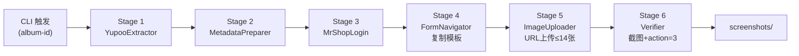
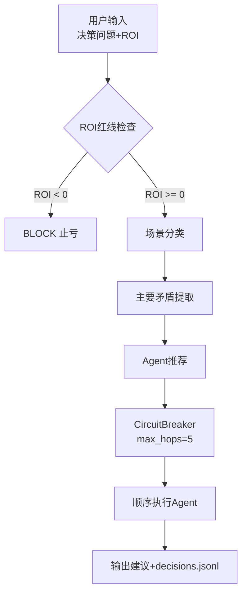

# CLAUDE.md

This file provides guidance to Claude Code (claude.ai/code) when working with code in this repository.

---

## 业务红线 (Business Critical Constraints)

> ⚠️ 以下为强制执行规则，违反将导致业务失败或账号风控

| 规则                       | 说明                            | 违规后果               |
| -------------------------- | ------------------------------- | ---------------------- |
| **禁止终端驱动浏览器** | 严禁使用终端脚本启动 Playwright 操作浏览器（指纹污染易被识别） | 触发风控拦截/验证码陷阱 |
| **登录故障检测**     | 遇到验证码、账号停用等登录阻碍即刻停止 | 触发封控/无效重试 |
| **图片 ≤14 张**     | 第15位留给尺码表                | 商品无法上架           |
| **并发待实现**      | 多CDP端口独立Chrome正在实现中   | 当前❌无法并发，SPA踩踏 |
| **独立浏览器上下文** | Yupoo/MrShopPlus 禁止共享Cookie | 会话污染               |
| **保存前截图**       | 每单必须留证                    | 无法追溯"假同步"       |
| **ASCII Only**       | .ps1/.bat严禁中文               | PowerShell 5.1解析错误 |
| **描述禁图** | 商品描述严禁包含任何图片，必须使用JS移除 `` 标签 | 页面排版崩溃/违反规范 |
| **强制双参校验**   | 必须提供真实 Brand & Product Name 第一行格式化，严禁空参跳过 | 信息残缺/劣质展示 |
| **严格静态类型校验**| 列表切片(如 `urls[:14]`)和关键变量必须显式类型标注 (`cast`)| 避免 `list[Unknown]` 运行截断 |
| **导入强隔离检测** | 核心依赖(Playwright)必须前置 `try/except ImportError` 断言 | 避免环境不对静默失败 |
| **审计汇报纯客观** | 所有审计总结必须输出 `.html` 数据报告，严禁主观评价，必须呈递原始数字 | AI幻觉掩盖异常真相 |

---

## 核心原则 (Core Principles)

1. **实事求是 (Truth-Based)**: 严禁基于假设编写路径，所有路径必须经过 `ls` 或 `dir` 验证。
2. **5W1H 计划法**: 复杂任务开始前，必须明确 Who/What/When/Where/Why/How。
3. **MECE 原则**: 逻辑拆解必须做到相互独立、完全穷尽。
4. **中文注释 (Chinese Annotations)**: 所有文档、注释、CLI输出必须包含中文翻译。
5. **ASCII-Only 脚本**: 所有 PS1/BAT 脚本严禁中文字符，确保Windows环境兼容性。

---

## 项目概述 (Project Overview)

本仓库包含**两个独立生产级子系统**：

### 1. Yupoo to MrShopPlus ERP 同步流水线
将 Yupoo 相册产品图片自动同步至 MrShopPlus ERP 完成上架。Playwright 浏览器自动化，6阶段 pipeline/orchestrator 架构。

**核心流程**：Yupoo 提取外链 → ERP 上传图片 → 自动保存验证 → 截图留证

### 2. 决策认知系统 v2.0
基于毛泽东思想四大方法论（实事求是、矛盾论、实践论、群众路线）的多智能体AI决策支持系统，服务于网红营销业务决策场景。

---

## 工作目录

**Path**: `C:\Users\Administrator\Documents\GitHub\ERP`

```bash
cd C:\Users\Administrator\Documents\GitHub\ERP
```

---

## 架构 (Architecture)

### Yupoo-to-ERP 同步流水线



### 决策认知系统 v2.0



**关键约束**: Yupoo 和 MrShopPlus 各自维护**独立浏览器上下文**，绝不共享Cookie或浏览器状态。

**关键设计**: ROI检查优先于任何分析，不可被Agent推理覆盖；电路熔断防止路由循环；JSONL追加日志可审计。

---

## 项目结构 (Project Structure)

```
ERP/
├── scripts/
│   └── sync_pipeline.py       # Yupoo-to-ERP 主入口 E2E编排器
├── decision_system/           # 决策认知系统 v2.0
│   ├── __init__.py
│   ├── __main__.py            # 模块入口 (python -m decision_system)
│   ├── circuit_breaker.py     # 熔断防循环
│   ├── cli.py                 # CLI接口
│   ├── config.py              # 配置常量
│   ├── logging_utils.py       # JSONL日志
│   ├── router.py              # 决策路由器
│   ├── types.py               # Pydantic数据模型
│   ├── workflow.py            # 工作流编排
│   └── tests/                 # pytest单元测试
│       ├── conftest.py
│       ├── pytest.ini
│       ├── test_circuit_breaker.py
│       ├── test_config.py
│       ├── test_router.py
│       └── test_types.py
├── logs/                      # 执行日志 + 状态持久化
│   ├── sync_YYYYMMDD.log      # 同步流水线每日日志
│   ├── decisions.jsonl        # 决策系统日志（JSONL追加）
│   ├── cookies.json           # MrShopPlus登录Cookie
│   ├── yupoo_cookies.json     # Yupoo登录Cookie
│   └── pipeline_state.json    # 流水线断点状态
├── screenshots/               # 上架前截图留证
├── _agent/workflows/          # Agent工作流定义
├── .agents/                   # Agent子模块workflows
├── .planning/                 # 项目规划文档（phase分阶段）
│   ├── PROJECT.md             # 决策系统项目概览
│   ├── REQUIREMENTS.md        # 需求清单
│   ├── ROADMAP.md             # 4阶段路线图
│   ├── codebase/              # 代码库分析
│   ├── research/              # 研究文档
│   │   ├── PRD_yupoo_to_erp_sync.md  # 同步流水线需求
│   │   └── PITFALLS.md        # 多智能体已知陷阱
│   └── phases/
│       └── 01-foundation-router/  # 阶段1完成（Foundation+Router）
├── .venv/                     # Python虚拟环境（不提交）
├── .env / .env.example        # 环境变量（凭证，不提交）
├── BROWSER_SUBAGENT_SOP.md    # 浏览器操作安全协议
├── GEMINI.md                  # AI规则与决策原则
├── memory.md                  # 项目经验教训
└── CLAUDE.md                  # 本文件（开发指南）
```

---

## 凭证管理 (Credentials)

> ⚠️ **唯一可信来源**: `.env` 文件。CLAUDE.md 中的凭证仅供参考对比。

```bash
# Yupoo
YUPOO_USERNAME=lol2024
YUPOO_PASSWORD=9longt#3
YUPOO_BASE_URL=https://lol2024.x.yupoo.com/albums

# MrShopPlus ERP
ERP_USERNAME=zhiqiang
ERP_PASSWORD=123qazwsx
ERP_BASE_URL=https://www.mrshopplus.com

# Pipeline settings
MAX_CONCURRENT_WORKERS=3
SAVE_SCREENSHOTS=True
DRY_RUN=False
```

凭证以 `os.getenv()` 方式读取，优先级：`.env` > 环境变量 > 脚本硬编码默认值。

---

## 常用命令 (Common Commands)

### 环境初始化

```bash
# 创建虚拟环境
python -m venv .venv

# Windows激活
.venv\Scripts\activate

# 安装依赖
pip install playwright pytest pydantic
playwright install chromium
```

### Yupoo-to-ERP 同步命令

```bash
# 全量同步（指定相册）
python scripts/sync_pipeline.py --album-id 231019138

# 使用CDP连接现有Chrome（绕过webdriver检测，需先启动Chrome）
python scripts/sync_pipeline.py --album-id 231019138 --use-cdp
```

> ⚠️ `--dry-run`、`--step`、`--resume` 参数在代码中**尚未实现**（CLAUDE.md 历史遗留描述）。如需断点续跑功能，需先实现 PipelineState.load()。

**CDP启动Chrome（Windows）**:
```bash
"C:\Program Files\Google\Chrome\Application\chrome.exe" --remote-debugging-port=9222
```

### 决策系统命令

```bash
# CLI文本输出
python -m decision_system "要不要给这个100万粉网红送价值5000的货" --roi -500

# JSON输出
python -m decision_system "要不要免费送鞋给这个网红" --output json
```

### 测试命令（决策系统）

```bash
# 运行所有测试
pytest decision_system/tests/ -v

# 运行单个测试文件
pytest decision_system/tests/test_router.py -v

# 覆盖率报告
pytest --cov=decision_system decision_system/tests/ -v
```

---

## Pipeline 6阶段详解

| Stage | 名称               | 核心动作                               | 关键约束                                    |
| ----- | ------------------ | -------------------------------------- | ------------------------------------------- |
| 1     | **EXTRACT**  | 直连 `/gallery/{id}` → `dispatch_event` 全选 → 提取 | 优先直连，禁止盲目搜索；使用事件触发点击 |
| 2     | **PREPARE**  | URL换行分隔，格式化元数据              | 提取尺码信息                                |
| 3     | **LOGIN**    | MrShopPlus Cookie认证                  | 优先加载 `cookies.json`                     |
| 4     | **NAVIGATE** | 访问商品列表并定位模板商品             | **严禁从0创建**；必须点击"复制"           |
| 5     | **UPLOAD**   | 替换标题、首行格式化 & 图片 (≤14张)    | 强制移除描述中所有img标签；必填品牌与品名 |
| 6     | **VERIFY**   | 截图 → 保存 → 观察 URL 变为 `action=3` | 必须有截图，URL变化是唯一可靠的成功标志   |

---

## 数据映射 (Data Flow)

| Yupoo来源        | MrShopPlus字段 | 处理逻辑                    |
| ---------------- | -------------- | --------------------------- |
| 相册标题         | `商品名称`   | 去除内部编号（如H110）      |
| 相册描述         | `商品描述`   | 提取尺码行（M/XL/2XL），移除所有图片 |
| 图片外链（≤14） | `商品图片`   | 第15位预留给尺码表          |
| 分类             | `类别`       | 分类名映射（BAPE→T-Shirt） |

---

## 状态管理 (State Management)

| 文件                   | 用途                           |
| ---------------------- | ------------------------------ |
| `logs/cookies.json`       | MrShopPlus登录Cookie（可复用） |
| `logs/yupoo_cookies.json` | Yupoo登录Cookie                |
| `logs/pipeline_state.json` | 流水线断点状态（支持resume）  |
| `screenshots/*.png`       | 商品保存前截图留证             |

---

## 决策系统业务红线 (Decision System Business Rules)

| 规则 | 动作 |
|------|------|
| **ROI 为负** → 立即 BLOCK，建议"止亏" | 硬约束，Agent推理不能覆盖 |
| **首次网红合作** → 推荐"Model B 压测"，$10/15videos | 新人测试业务规则 |
| **流量门槛** → ≥1000播放才符合合作资格 | 质量控制 |

---

## 约束与限制 (Constraints)

| 约束 | 说明 |
|------|------|
| **Cookie刷新** | 会话Cookie需定期手动刷新 |
| **并发限制** | **❌ 当前无法并发**：CDP共享Chrome session导致ERP表单SPA路由互相踩踏 |
| **重试机制** | sync_pipeline 内置指数退避重试（最多3次） |
| **测试覆盖** | 决策系统有完整单元测试，同步流水线无自动化测试（需手动验证） |
| **每小时产出** | 顺序执行 ~ **30 商品/小时** |
| **并发改造方向** | 每个worker需独立Chrome实例 + 不同CDP端口（9222/9223/...） |

---

## 经验教训 (Lessons Learned)

| 日期 | 问题 | 教训/解决方案 |
|------|------|--------------|
| 2026-04-03 | Yupoo触发阿里云滑块验证码 | 立即停止，绝不重试，等待人工处理 |
| 2026-04-03 | Yupoo选择器变化 | 使用健壮的CSS选择器，优先占位符选择 |
| 2026-04-03 | 搜索导航不稳定 | 直连 `/gallery/{album_id}` 最稳定 |
| 2026-04-03 | 元素不在视口点击失败 | `dispatch_event` 作为备用点击方案 |
| 2026-04-07 | 缺失品牌参数导致模板脏数据 | Brand/Product必填，空参抛出 ValueError 强制失败 |
| 2026-04-08 | 并发踩踏：多worker共享CDP session | **ERP是SPA路由**，"复制"按钮点击后页面状态变化，多worker共享=踩踏 |
| 2026-04-08 | Tab池架构错：ERP"复制"不是新Tab | ERP点击"复制"是SPA内部路由跳转，不会产生新Tab/window |
| 2026-04-08 | JS eval单引号转义失败 | CSS选择器含单引号时用 `json.dumps(selector)` 转义后再塞入JS |
| 2026-04-08 | 独立Browser Context的Cookie注入失败 | 仅注入Cookie不够，Yupoo需要完整localStorage session |
| 2026-04-08 | `.img-upload-btn` 选择器不存在 | 上传按钮真实class是 `.upload-container.editor-upload-btn`（描述区域）和 `.avatar-upload-wrap`（主图） |
| 2026-04-08 | URL上传弹窗的textarea位置 | 必须先点击 `.el-tabs__item:has-text('URL')` 切换tab，再填 `.el-dialog .el-textarea__inner` |
| 2026-04-08 | TinyMCE编辑器在iframe内，`page.evaluate()` 无法访问 | 必须用 `page.frame()` 遍历所有 frame，找到含 `#tinymce` 的那个，再在其上下文执行JS |
| 2026-04-08 | 复制按钮点击后跳转到 `action=4` 表单页 | URL变为 `/#/product/form_DTB_proProduct/0?action=4&pkValues=...`，需等待5秒让TinyMCE初始化 |
| 2026-04-08 | **完整流水线验证成功** | Yupoo提取→CDP cookie注入→复制模板→TinyMCE格式化→URL上传14张图→保存action=3，全程无需人工介入 |
| 2026-04-07 | 隐式切片缺少类型标注失败 | 所有列表切片必须显式 `cast` 类型 |
| 2026-04-07 | Playwright未安装静默失败 | 前置 try/except ImportError 检查 |

---

## 并发踩坑记录（2026-04-08）

详见 `logs/CONCURRENT_DEBUG_20260408.md`。**核心结论**：

> `sync_pipeline.py` **单worker + CDP共享Chrome** 是当前唯一稳定方案。
> 想真并发 → 每个worker必须用**独立Chrome实例 + 不同CDP端口**（待实现）。

---

## Yupoo图片提取新方案（2026-04-08）

> 通过CDP拦截 `/api/albums/{id}/photos` XHR响应提取完整外链

| 步骤 | 方法 | 说明 |
|------|------|------|
| 1 | 访问 `https://x.yupoo.com/gallery/{album_id}` | 触发API请求 |
| 2 | `page.on('response')` 拦截含 `/api/albums/{id}/photos` 的响应 | CDP拦截，无需额外认证 |
| 3 | `body['data']['list'][i]['path']` | API返回完整path如 `/lol2024/b87b319e/554e2f8e.jpeg` |
| 4 | 拼接 `http://pic.yupoo.com{library/path}` | 验证→200 OK，可直接下载 |

**旧方案（失败）**：HTML提取photo_id后拼 `/pic.yupoo.com/{user}/{pid}/`（缺hash，返回404）
**新方案（成功）**：API拦截获取完整path（含hash），直接拼外链，requests验证200 OK

---

## ERP图片上传阻塞点（2026-04-08）

> URL上传方式**失败**，textarea存在maxlength限制截断URL

| 步骤 | 状态 | 说明 |
|------|------|------|
| textarea填充 | ✅ | `.el-dialog .el-textarea__inner` + `.fill()` 或 JS `ta.value=` 均可 |
| URL验证 | ✅ | `http://pic.yupoo.com/lol2024/b87b319e/554e2f8e.jpeg` → requests验证 **200 OK** |
| **textarea maxlength** | ❌ | URL被截断（153字符限制），`.jpeg` 变成 `.jpe`，下载失败 |
| action=3保存 | ❌ | 上传0张图，无法保存 |

**根因**：ERP textarea 有 `maxlength=153` 限制，长URL被截断 → 服务器下载失败
**修复方向**：改用**本地上传**（图片先下载到 `temp_images/`，用 `input[type=file]` 上传）

## ERP 已验证选择器（2026-04-08）

> 以下选择器已通过生产环境验证，是最可靠的定位方式

| 功能 | 选择器 | 说明 |
|------|--------|------|
| 商品列表"复制"按钮 | `.operate-area .el-icon-document-copy` | Element Plus 图标按钮，非FontAwesome |
| 图片上传入口 | `.upload-container.editor-upload-btn` | 编辑区上传按钮 |
| URL上传Tab | `.el-tabs__item:has-text('URL')` | Element Plus Tab（不能用#tab-xxx ID）|
| URL输入框 | `.el-dialog .el-textarea__inner` | 弹窗内textarea（注意：有maxlength限制）|
| 确认上传按钮 | `.el-dialog__footer button.el-button--primary` | 弹窗底部确认 |
| TinyMCE iframe | `iframe[id^='vue-tinymce']` | Vue tinymce编辑器iframe |
| TinyMCE可编辑body | `#tinymce` | iframe内的可编辑区域 |
| 商品名称输入 | `input[placeholder='请输入商品名称']` | ERP表单标题字段 |
| 尺码输入 | `.size-chart-input input` | 尺码表输入框 |
| 保存按钮 | `button:has-text('保存')` | 商品保存（触发action=3） |

---

## 参考文档

| 文档 | 位置 | 用途 |
|------|------|------|
| **BROWSER_SUBAGENT_SOP.md** | `/BROWSER_SUBAGENT_SOP.md` | 浏览器操作安全协议 |
| **GEMINI.md** | `/GEMINI.md` | AI规则与决策原则 |
| **memory.md** | `/memory.md` | 完整项目历史变更与经验 |
| **logs/CONCURRENT_DEBUG_20260408.md** | `/logs/CONCURRENT_DEBUG_20260408.md` | 并发踩坑完整记录（5类失败模式+5条核心教训） |
| **PRD_yupoo_to_erp_sync.md** | `/.planning/research/PRD_yupoo_to_erp_sync.md` | 同步流水线完整需求 |
| **PITFALLS.md** | `/.planning/research/PITFALLS.md` | 多智能体系统已知陷阱 |
| **ROADMAP.md** | `/.planning/ROADMAP.md` | 决策系统四阶段路线图 |

---

## 项目状态 (2026-04-08)

| 模块 | 状态 | 说明 |
|------|------|------|
| Yupoo-to-ERP 同步流水线 | ✅ **已上线运行** | 全流程可工作，已成功同步商品，所有业务红线已实现 |
| 决策认知系统 v2.0 | 🚧 **Phase 1 完成** | 核心路由器、熔断、日志、CLI已完成并测试；Phase 2-4 待开发 |

---

## 已知问题清单（5Agent并发审查 — 2026-04-08）

> ⚠️ 以下为代码审查发现的已知问题，已核实。修复优先级：P0 > P1 > P2

### P0 — 必须修复

| # | 问题 | 证据 | 修复方向 |
|---|------|------|----------|
| P0-1 | **凭证硬编码默认值** | `sync_pipeline.py:265` `os.getenv("ERP_PASSWORD", "123qazwsx")` 回退值与.env不一致 | 删除硬编码回退，env缺失时报错退出 |
| P0-2 | **Cookie无过期检测** | `sync_pipeline.py:L366-375` 加载cookie后直接使用，不检查expiry字段 | 添加expiry验证，过期时告警 |
| P0-3 | **concurrent_batch_sync.py 共享context Bug** | `L391-398` `use_cdp=True`时所有worker共享`browser.contexts[0]`，违反"独立浏览器上下文"红线 | CDP模式必须每个worker独立context |
| P0-4 | **sync_pipeline.py零测试** | 全文803行无pytest | 补充Stage级集成测试 |
| P0-5 | **workflow.py核心编排无测试** | `workflow.py:L75-102` 的run()方法ROI guard和快速通道分支无覆盖 | 补充≥5个测试用例 |
| P0-6 | **无requirements.txt** | CLAUDE.md仅列包名无版本，pip install行为不可复现 | 创建requirements.txt并锁定版本 |

### P1 — 应该修复

| # | 问题 | 证据 | 修复方向 |
|---|------|------|----------|
| P1-1 | **Magic Number散落** | timeout值在L98/209/227/317/383/707/710多处不一致；`urls[:14]`无常量解释 | 提取为模块常量：IMAGE_LIMIT=14, DEFAULT_TIMEOUT_MS=5000等 |
| P1-2 | **bare except静默吞异常** | `sync_pipeline.py:L275/346/497`等多处`except: pass`无日志 | 改为`logger.warning()`或`raise` |
| P1-3 | **日志无trace_id** | `logging.basicConfig`格式无job_id/session_id关联字段 | 追加job_id/album_id字段支持关联查询 |
| P1-4 | **并发脚本未隔离** | `scripts/`目录4个废弃脚本与sync_pipeline.py并列 | 移至`scripts/archive/`目录 |
| P1-5 | **YupooExtractor硬编码用户名** | `sync_pipeline.py:L310` `self.user = "lol2024"` 注释说"从cookies读取"但未实现 | 从cookies或env读取 |
| P1-6 | **captcha检测缺失** | CLAUDE.md红线要求"遇到验证码即刻停止"，但sync_pipeline.py无验证码检测逻辑 | 添加验证码元素检测，发现即停止 |
| P1-7 | **strict静态类型校验缺失** | CLAUDE.md要求`cast`标注，但代码无`from typing import cast` | 添加cast导入，列表切片显式标注 |
| P1-8 | **TinyMCE死代码** | `sync_pipeline.py:L588-591` 有未完成的`pass`空块 | 删除无效代码 |

### P2 — 值得改进

| # | 问题 | 证据 | 修复方向 |
|---|------|------|----------|
| P2-1 | **workflow.py L84冗余判断** | `router_dict.get("scenario_type") == "blocked"` 字符串比较永远不为True（应为枚举） | 删除死代码 |
| P2-2 | **CDP连接逻辑3套互斥方案** | v1(共享context)/v2(独立context)/v3(subprocess)各自独立非递进 | 统一为独立Chrome多端口架构 |
| P2-3 | **环境变量加载无明确错误** | `.env`字段缺失时os.getenv回退到硬编码，无明确日志 | env缺失字段时logger.error并sys.exit(1) |

**This file updated: 2026-04-08**
